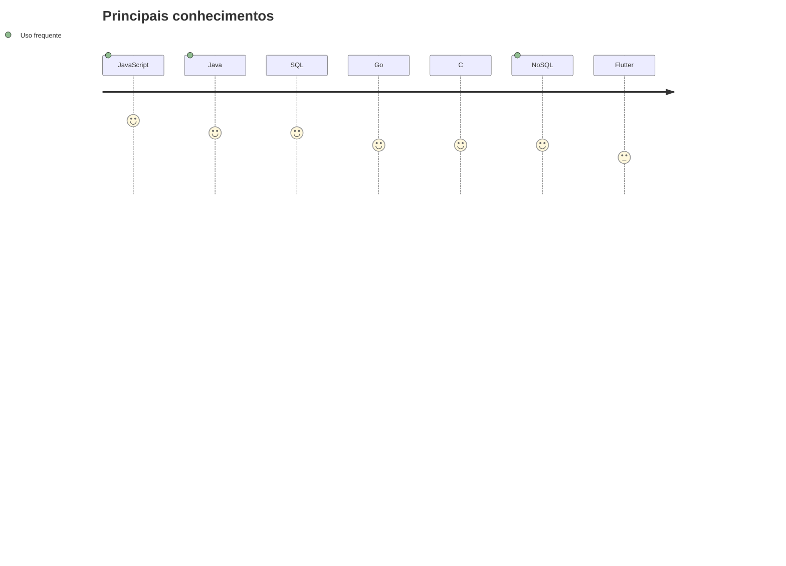

   

# Olá, sou CaioPin 🫧

✏️ Desenvolvendo de tudo um pouco 
🎓 Graduado em Análise e Desenvolvimento de Sistemas 
📚 Gosto de aprender e experimentar novas tecnologias 
🎨 Fã dos designs (e sempre tentando aprimorar o meu 🫣) 
🎶 Adoro ouvir música e conversar a todo momento 💬
   

## Alguns projetos

&nbsp;&nbsp;&nbsp;&nbsp;&nbsp;&nbsp;&nbsp;&nbsp;&nbsp;&nbsp;
&nbsp;&nbsp;&nbsp;&nbsp;&nbsp;&nbsp;&nbsp;&nbsp;&nbsp;&nbsp;
&nbsp;&nbsp;&nbsp;&nbsp;&nbsp;&nbsp;&nbsp;&nbsp;&nbsp;&nbsp;

   

## Tecnologias utilizadas

&nbsp;&nbsp;&nbsp;&nbsp;&nbsp;&nbsp;&nbsp;&nbsp;&nbsp;&nbsp;

&nbsp;&nbsp;&nbsp;&nbsp;&nbsp;&nbsp;&nbsp;&nbsp;&nbsp;&nbsp;

&nbsp;&nbsp;&nbsp;&nbsp;&nbsp;&nbsp;&nbsp;&nbsp;&nbsp;&nbsp;

  

